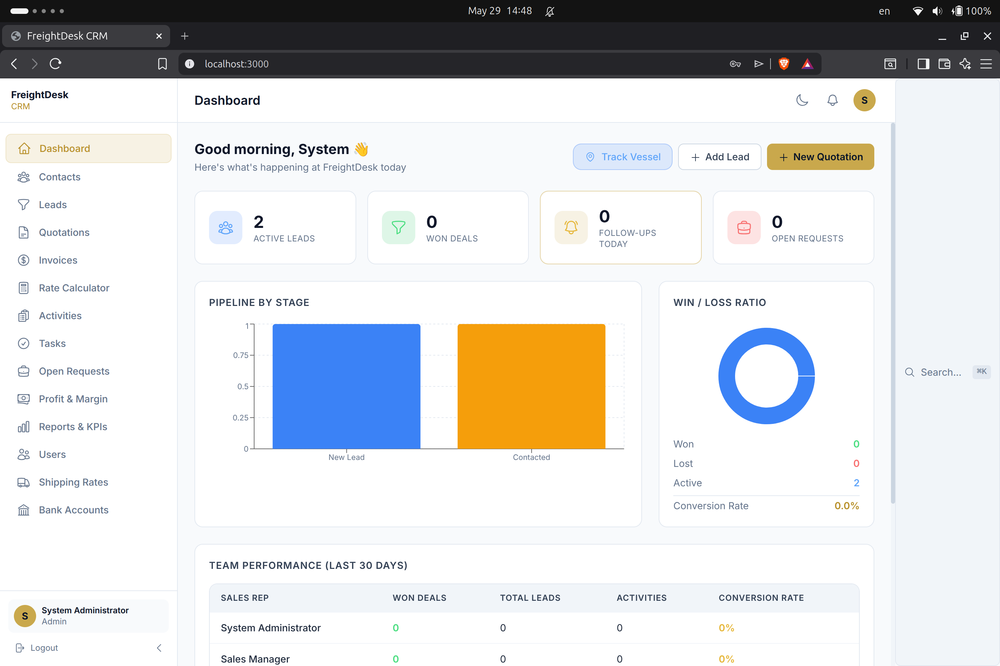
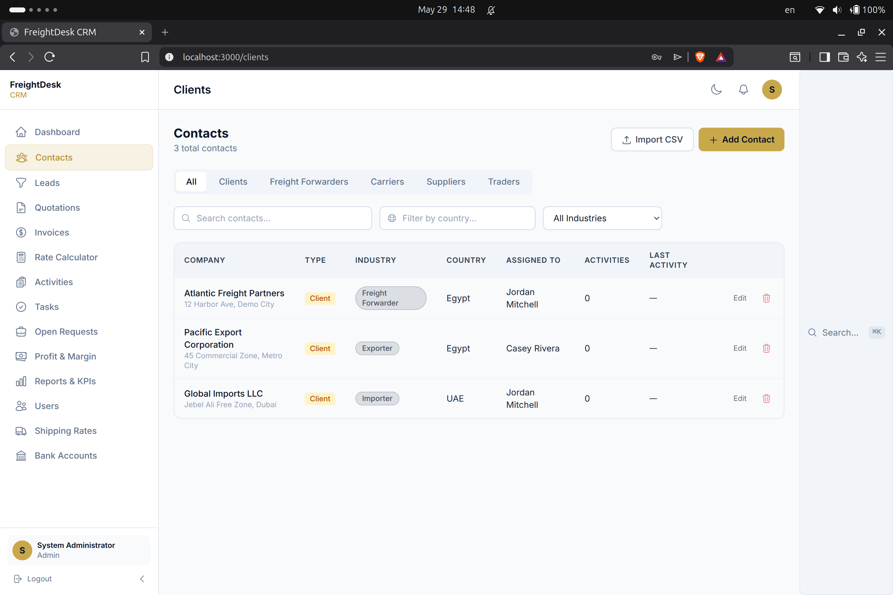
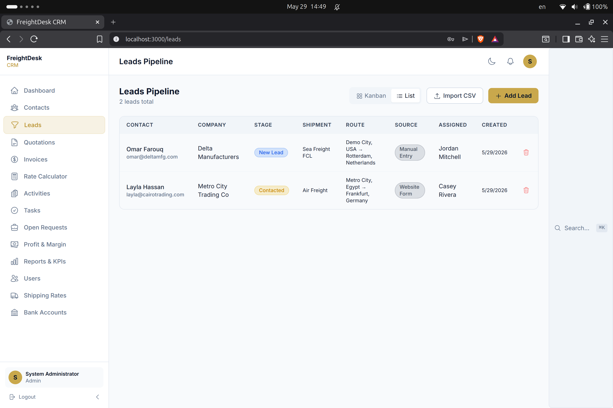
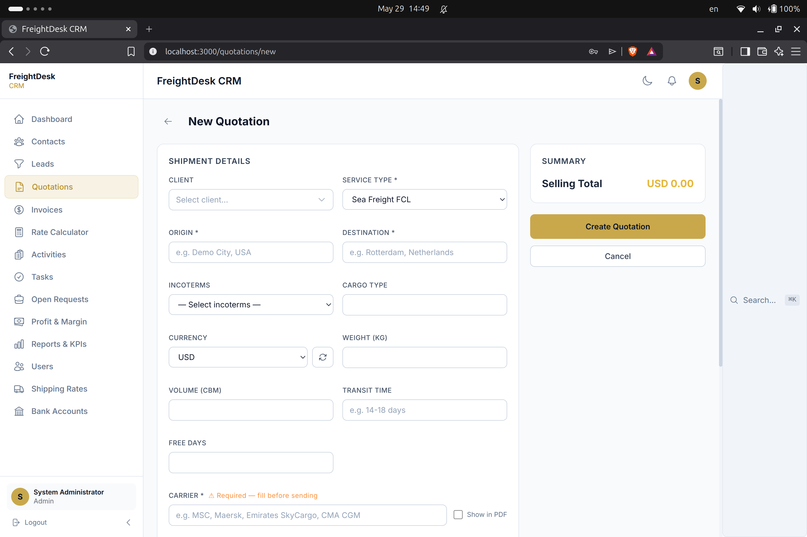
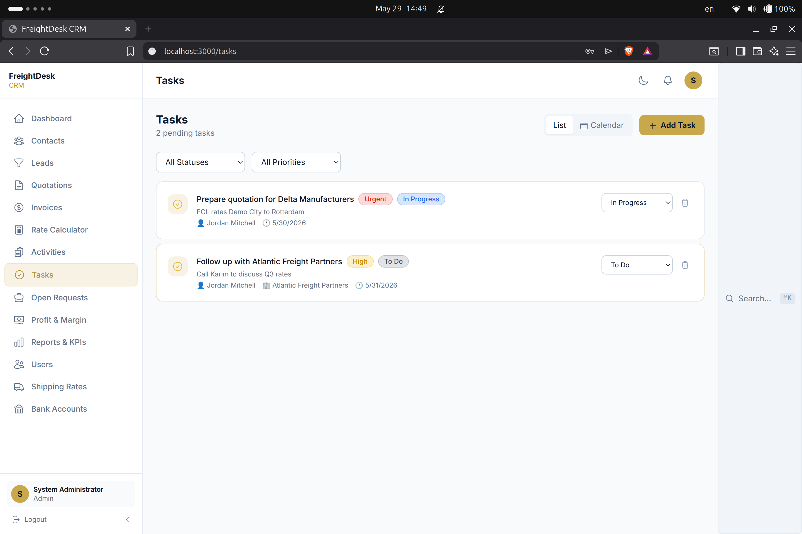
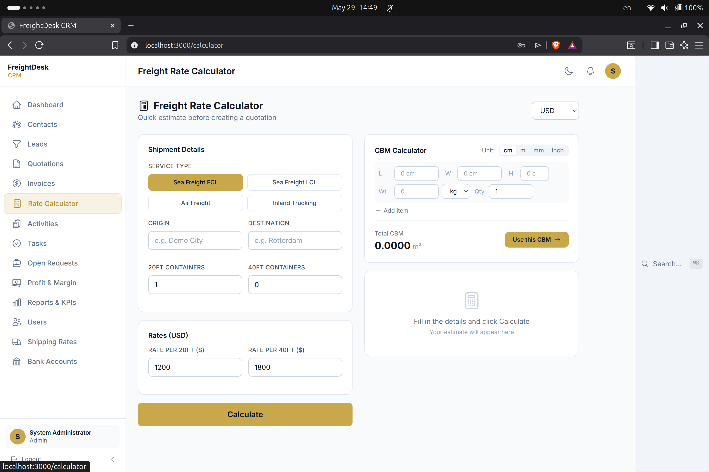
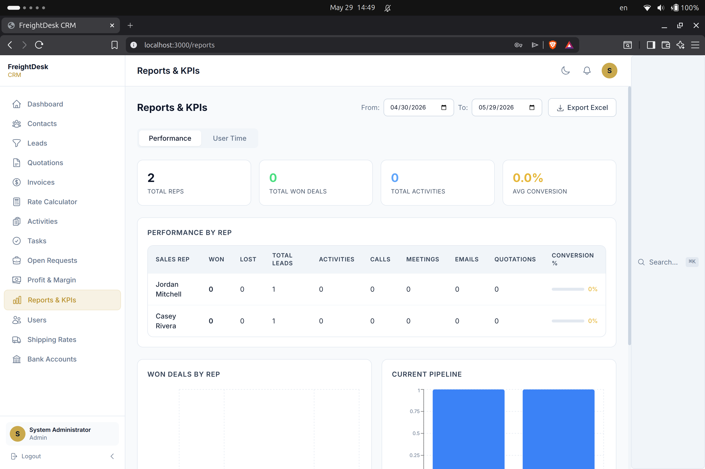
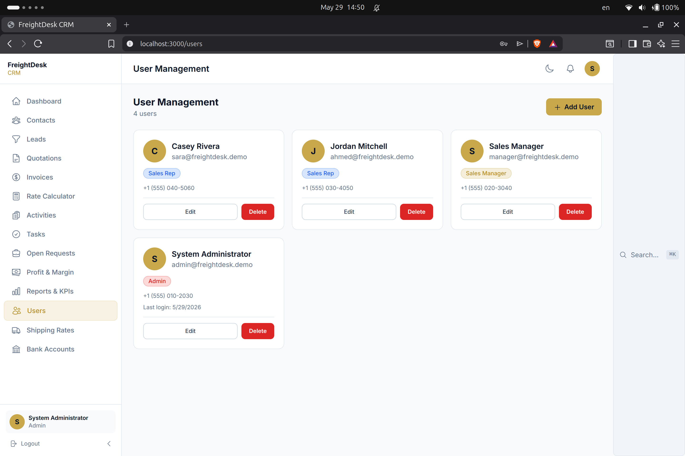

# FreightDesk CRM

A CRM I built for a freight forwarding and logistics company to handle the
day-to-day: clients, leads, quotations, invoices, and reports — all in one place.
It's a real system, used in production by Safty Group, and this repo is a clean
demo version of it.

**Stack:** React 18 · Node.js · PostgreSQL · Docker

---

## Screenshots

### Dashboard


### Clients & Contacts


### Leads Pipeline


### Quotation Builder


### Freight Rate Calculator


### Tasks


### Reports & KPIs


### User Management


---

## Features

- **Pipeline Board** — drag-and-drop lead and deal management across stages
- **Client Management** — full client profiles, contact history, and activity logs
- **Quotation Engine** — generate branded PDF quotations with one click (PDFKit)
- **Excel Export** — export reports and client lists as `.xlsx` (ExcelJS)
- **Role-Based Access** — Admin, Sales Manager, and Sales Rep roles with granular permissions
- **JWT Authentication** — access + refresh token rotation with secure httpOnly cookies
- **Analytics Dashboard** — revenue tracking, conversion rates, and team performance charts
- **Progressive Web App** — installable on desktop and mobile, works offline

---

## Tech Stack

| Layer | Technology |
|---|---|
| Frontend | React 18, Tailwind CSS, Recharts, PWA |
| Backend | Node.js, Express |
| Database | PostgreSQL 16 |
| Auth | JWT + Refresh Token Rotation |
| PDF | PDFKit |
| Excel | ExcelJS |
| Deployment | Docker Compose + Nginx |

---

## Quick Start

### Option 1 — Docker Compose (Recommended)

Requires: [Docker Desktop](https://www.docker.com/products/docker-desktop/)

```bash
git clone https://github.com/Marawan-El-Safty/FreightDesk-CRM.git
cd FreightDesk-CRM
cp backend/.env.example backend/.env
# Edit backend/.env — set DB_PASSWORD, JWT_SECRET, JWT_REFRESH_SECRET
docker-compose up -d
```

Open [http://localhost:3000](http://localhost:3000)

### Option 2 — Manual

**Prerequisites:** Node.js 18+, PostgreSQL 14+

```bash
# Backend
cd backend
npm install
cp .env.example .env
# Edit .env with your DB credentials and JWT secrets
npm run migrate
npm run seed
npm start

# Frontend (separate terminal)
cd frontend
npm install
npm start
```

---

## Demo Credentials

| Role | Email | Password |
|---|---|---|
| Admin | admin@freightdesk.demo | Demo@1234 |
| Sales Manager | manager@freightdesk.demo | Demo@1234 |
| Sales Rep | jordan@freightdesk.demo | Demo@1234 |

---

## Project Structure

```
FreightDesk-CRM/
├── frontend/               # React 18 PWA
│   ├── src/
│   │   ├── components/     # Reusable UI components
│   │   ├── pages/          # Route-level page components
│   │   ├── hooks/          # Custom React hooks
│   │   ├── services/       # API service layer
│   │   └── store/          # State management
│   └── public/
├── backend/                # Node.js + Express API
│   └── src/
│       ├── controllers/    # Route handlers
│       ├── middleware/      # Auth, error handling
│       ├── routes/         # API route definitions
│       ├── services/       # Business logic (PDF, Excel, email)
│       └── config/         # DB connection, migrations
├── database/
│   ├── schema.sql          # Full database schema
│   └── seed.sql            # Demo data
└── docker-compose.yml      # Full-stack containerized deployment
```

---

## API Overview

| Method | Endpoint | Description |
|---|---|---|
| POST | `/api/auth/login` | Login, returns access + refresh tokens |
| POST | `/api/auth/refresh` | Refresh access token |
| GET | `/api/clients` | List all clients (paginated) |
| POST | `/api/quotations` | Create quotation |
| GET | `/api/quotations/:id/pdf` | Download quotation as PDF |
| GET | `/api/reports/export` | Export report as Excel |

---

## About

I built and deployed this for a logistics company. If you're after something
similar — a CRM, an internal tool, a dashboard, or a business site — feel free to
reach out.

**Marawan El Safty** — Web Developer
[GitHub](https://github.com/Marawan-El-Safty) · [Email](mailto:marawan.elsafty@ejust.edu.eg)
